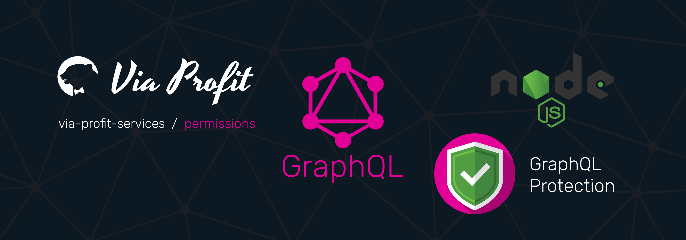

# Via Profit services / Permissions

> Via Profit services / **Permissions** - Schema protection.

This module allows you to set restrictions on access to certain fields of your schema, for example, only users with a certain role or only registered users.

## Documentation [here](https://node.e1g.ru/docs/permissions)

## License
The  [MIT](./LICENSE) License.